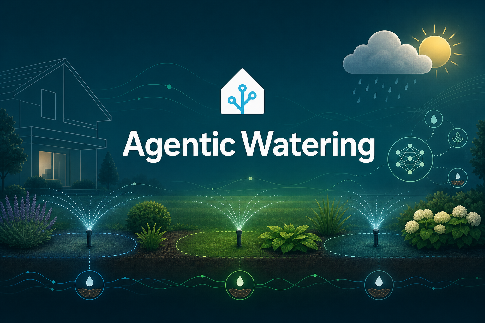
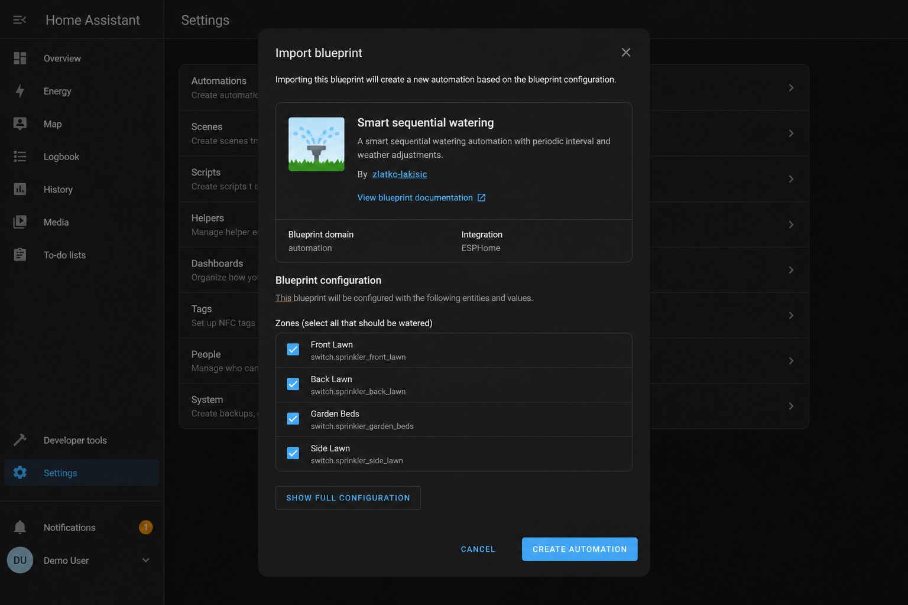

# Agentic Watering for Home Assistant (HACS)

<p align="center">
  
</p>

[](https://github.com/zlatko-lakisic/hacs-agentic-watering/actions/workflows/ci.yml)
[](https://github.com/zlatko-lakisic/hacs-agentic-watering/releases)
[](https://github.com/hacs/integration)
[](LICENSE)

> **CI status:** Green = [all checks passed](https://github.com/zlatko-lakisic/hacs-agentic-watering/actions/workflows/ci.yml) on `main` (HACS validation, Hassfest, YAML + blueprint tests). Red = open Actions for logs.

Each dusk or dawn run, an LLM reads your **forecast**, **soil moisture**, and **past watering history**, then decides per zone whether to water, skip, and for how long. Zones run **one at a time** through your valve integration; run state is **snapshotted to MQTT** so a interrupted run can resume where it left off. That closed loop — sense → reason → act → remember — is what makes this *agentic*, not just a timer with an API call.

## Prerequisites

Before you read the component list, confirm this fits your setup:

- Home Assistant **2024.6.0** or newer
- [HACS](https://hacs.xyz/) installed
- An **OpenAI-compatible LLM HTTP API** (chat completions endpoint + API key)
- An irrigation integration that exposes **start** and **stop watering** services on valve entities

**Supported irrigation integrations:** anything that provides `domain.start_watering` and `domain.stop_watering` services you can pass into the blueprint — for example **Orbit B-hyve** (`bhyve.start_watering` / `bhyve.stop_watering`). The script calls those services by name; it is not tied to a single vendor.

## How it works

1. **Trigger** — Sunrise, sunset, or manual run via the blueprint automation.
2. **Gather context** — OpenWeatherMap + Open-Meteo precipitation, Recorder history for soil sensors and valves, optional weather entity forecast.
3. **Baseline plan** — Deterministic minutes per zone from temperature, rain, sun exposure, and soil bands.
4. **Per-zone LLM call** — Model receives zone profile, probe readings, and history; replies with `0` (skip) or `2–25` minutes.
5. **Water one zone** — Start/stop services run sequentially with a short delay between valves.
6. **Snapshot state** — `in_progress`, next zone index, and full run config published to MQTT (retained).
7. **Next zone** — Repeat until the list is done; completion notification summarizes the run.

<p align="center">
  
</p>
<p align="center"><em>Import the blueprint under Settings → Automations → Create automation → Import blueprint.</em></p>

## What you get

| Component | Entity / path |
|-----------|----------------|
| Blueprint | `zlatko-lakisic/smart_sequential_watering.yaml` |
| Script | `script.ai_sequential_watering` |
| REST commands | `rest_command.openweathermap_5day_forecast`, `open_meteo_precipitation_past_24h`, `homeassistant_history_*`, `ollama_chat_completions` |

Site-specific zones, sensors, API keys, and runtime helpers live in **your** blueprint instance and a small local instance package — nothing is hardcoded to one garden.

## Installation

See **[docs/INSTALL.md](docs/INSTALL.md)** for `configuration.yaml` package includes and a site instance template.

### Via HACS (recommended)

1. **HACS → Integrations → ⋮ → Custom repositories**
2. Add `https://github.com/zlatko-lakisic/hacs-agentic-watering` as category **Integration**
3. Search **Agentic Watering**, download, restart Home Assistant
4. Add the package includes to `configuration.yaml` (see INSTALL.md)
5. Create a site instance package (helpers + MQTT snapshot + resume automation)
6. **Settings → Automations → Create automation → Import blueprint** → *Smart sequential watering*

### Manual install

```powershell
powershell -ExecutionPolicy Bypass -File scripts/install-to-ha.ps1 -ConfigRoot '\\your-ha-host\config'
```

Restart Home Assistant, then add the `configuration.yaml` package includes from [docs/INSTALL.md](docs/INSTALL.md).

## Blueprint inputs

The blueprint accepts ordered zone blocks (valve, soil sensors, plant profile, hardware notes), location, weather/history sensors, LLM/API helpers, irrigation services, and runtime state helpers (`in_progress`, `next_index`, MQTT snapshot topic, etc.).

## Disclaimer

This automation controls **real irrigation valves**. An LLM chooses skip/run duration from sensor and weather context — always **test with simulate mode or a short manual run**, watch the first live cycle, and confirm zones behave as expected before leaving it unattended.

## Contributing & issues

- **Bug reports & feature requests:** [GitHub Issues](https://github.com/zlatko-lakisic/hacs-agentic-watering/issues)
- **Pull requests welcome** — run `python tests/validate_yaml_packages.py` and `python tests/validate_blueprint.py` locally; CI must pass on `main`.

## License

MIT — see [LICENSE](LICENSE).
